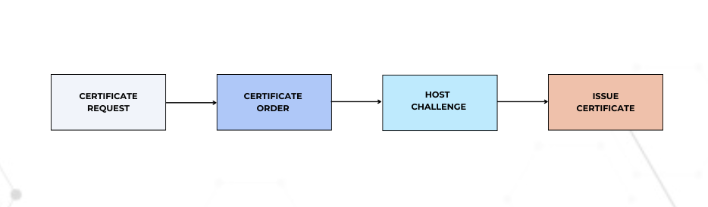

# Project-25
## DEPLOYING AND PACKAGING APPLICATIONS INTO KUBERNETES WITH HELM

In the previous project, you started experiencing helm as a tool used to deploy an application into Kubernetes.

In this project, you will experience deploying more DevOps tools, get familiar with some of the real world issues faced during such deployments and how to fix them. You will learn how to tweak helm values files to automate the configuration of the applications you deploy. Finally, once you have most of the DevOps tools deployed, you will experience using them and relate with the DevOps cycle and how they fit into the entire ecosystem.

Our focus will be on the following tools.

1. Artifactory
2. Hashicorp Vault
3. Prometheus
4. Grafana
5. Elasticsearch ELK using ECK

For the tools that require paid license, don’t worry, you will also learn how to get the license for free and have true experience exactly how they are used in the real world.

### Atrifactory
Lets start first with Artifactory. What is it exactly?

Artifactory is part of a suit of products from a company called Jfrog. Jfrog started out as an artifact repository where software binaries in different formats are stored. Today, Jfrog has transitioned from an artifact repository to a DevOps Platform that includes CI and CD capabilities. This has been achieved by offering more products in which Jfrog Artifactory is part of. Other offerings include:

- JFrog Pipelines – a CI-CD product that works well with its Artifactory repository. Think of this product as an alternative to Jenkins.
- JFrog Xray – a security product that can be built-into various steps within a JFrog pipeline. Its job is to scan for security vulnerabilities in the stored artifacts. It is able to scan all dependent code.

In this project, the requirement is to use Jfrog Artifactory as a private registry for the organisation’s Docker images and Helm charts. This requirement will satisfy part of the company’s corporate security policies to never download artifacts directly from the public into production systems. We will eventually have a CI pipeline that initially pulls public docker images and helm charts from the internet, store in artifactory and scan the artifacts for security vulnerabilities before deploying into the corporate infrastructure. Any found vulnerabilities will immediately trigger an action to quarantine such artifacts.

Lets get into action and see how all of these work.

## Deploy Jfrog Artifactory into Kubernetes
The best approach to easily get Artifactory into kubernetes is to use helm.

1. Search for an official helm chart for Artifactory on Artifact Hub
2. Add the jfrog remote repository on your laptop/computer
```
helm repo add jfrog https://charts.jfrog.io
```
3. Create a namespace called tools where all the tools for DevOps will be deployed. (In previous project, you installed Jenkins in the default namespace. You should uninstall Jenkins there and install in the new namespace)
```
kubectl create ns tools
```
4. Update the helm repo index on your laptop/computer
```
helm repo update
```

5. Install artifactory
```
helm upgrade --install artifactory jfrog/artifactory -n tools

```

For changing the nginx service type to ClusterIP instead of LoadBalancer

```
helm upgrade --install artifactory jfrog/artifactory --set nginx.service.type=ClusterIP -n tools
```

```
NAME: artifactory
LAST DEPLOYED: Fri Mar 31 14:48:14 2023
NAMESPACE: tools
STATUS: deployed
REVISION: 1
TEST SUITE: None
NOTES:
Congratulations. You have just deployed JFrog Artifactory!

1. Get the Artifactory URL by running these commands:

   NOTE: It may take a few minutes for the LoadBalancer IP to be available.
         You can watch the status of the service by running 'kubectl get svc --namespace tools -w artifactory-artifactory-nginx'

   export SERVICE_IP=$(kubectl get svc --namespace tools artifactory-artifactory-nginx -o jsonpath='{.status.loadBalancer.ingress[0].ip}')
   echo http://$SERVICE_IP/

2. Open Artifactory in your browser
   Default credential for Artifactory:
   user: admin
   password: password
   ```

## Blocker
I could not deploy artifactory. The "artifactory" container will not run because the init containers delete-db-properties (init), remove-lost-found (init), copy-system-configurations (init), wait-for-db (init), migration-artifactory (init) will not complete. It will deploy and the container will not run.

## Solution
I learnt that the issue is because the EBS volume attached to the nodes of the eks cluster is small and not sufficient to deploy artifactory. It was 20Gib and when I increased it to 500Gib the problem was solved.
### Getting the Artifactory URL
Lets break down the first Next Step.

1. The artifactory helm chart comes bundled with the Artifactory software, a PostgreSQL database and an Nginx proxy which it uses to configure routes to the different capabilities of Artifactory. Getting the pods after some time, you should see something like the below.

```
$ kubectl get po -n tools
NAME                                             READY   STATUS     RESTARTS   AGE
artifactory-0                                    0/1     Init:4/5   0          85s
artifactory-artifactory-nginx-7d57dfb7b8-9hhsv   0/1     Running    0          85s
artifactory-postgresql-0                         1/1     Running    0          85s

$ kubectl get po -n tools
NAME                                             READY   STATUS    RESTARTS   AGE
artifactory-0                                    0/1     Running   0          97s
artifactory-0                                    0/1     Running   0          2m1s
artifactory-artifactory-nginx-7d57dfb7b8-9hhsv   0/1     Running   0          2m1s
artifactory-postgresql-0                         1/1     Running   0          2m1s

$ kubectl get po -n tools
NAME                                             READY   STATUS    RESTARTS   AGE
artifactory-0                                    0/1     Running   0          2m52s
artifactory-artifactory-nginx-7d57dfb7b8-9hhsv   0/1     Running   0          2m52s
artifactory-postgresql-0                         1/1     Running   0          2m52s
```

```
$ kubectl describe po artifactory-0 -n tools
Name:         artifactory-0
Namespace:    tools
Priority:     0
Node:         ip-10-0-3-96.us-east-2.compute.internal/10.0.3.96
Start Time:   Fri, 31 Mar 2023 14:48:34 +0100
Labels:       app=artifactory
              chart=artifactory-107.55.9
              component=artifactory
              controller-revision-hash=artifactory-b7c9f5dbb
              heritage=Helm
              release=artifactory
              role=artifactory
              statefulset.kubernetes.io/pod-name=artifactory-0
Annotations:  checksum/access-config: d3c37fd9112c78ef046b6f00e874964dd079c7f9d19f7fc02511ade83e55fd8b
              checksum/admin-creds: 01ba4719c80b6fe911b091a7c05124b64eeece964e09c058ef8f9805daca546b
              checksum/binarystore: 1c86d11aa6d82919d2ba85592f67f0c515a78db57b2efecf51f351021d1905f4
              checksum/database-secrets: 01ba4719c80b6fe911b091a7c05124b64eeece964e09c058ef8f9805daca546b
              checksum/systemyaml: 71d4da3e7f892510dcc7117c681503b39e4ec99afff18a9c4ed00102b522b7c0
              kubernetes.io/psp: eks.privileged
Status:       Running
IP:           10.0.3.251
IPs:
  IP:           10.0.3.251
Controlled By:  StatefulSet/artifactory
Init Containers:
  delete-db-properties:
    Container ID:  containerd://e973a33bbee4ceb381991deba61f18a74679e82c2cca15becd89b793007d9050
    Image:         releases-docker.jfrog.io/ubi9/ubi-minimal:9.1.0.1760
    Image ID:      releases-docker.jfrog.io/ubi9/ubi-minimal@sha256:03a342cfc1f7a0e26a0c23881e92ad95871d48e759b45fee052afeeaf1b33111
    Port:          <none>
    Host Port:     <none>
    Command:
      bash
      -c
      rm -fv /var/opt/jfrog/artifactory/etc/db.properties
    State:          Terminated
      Reason:       Completed
      Exit Code:    0
      Started:      Fri, 31 Mar 2023 14:48:58 +0100
      Finished:     Fri, 31 Mar 2023 14:48:58 +0100
    Ready:          True
    Restart Count:  0
    Limits:
      cpu:     1
      memory:  1Gi
    Requests:
      cpu:        10m
      memory:     50Mi
    Environment:  <none>
    Mounts:
      /var/opt/jfrog/artifactory from artifactory-volume (rw)
      /var/run/secrets/kubernetes.io/serviceaccount from kube-api-access-hjwkc (ro)
  remove-lost-found:
    Container ID:  containerd://4edb3b7b9157f2800bdc21d33edfb71c36385b6ebcdda6678b50698c3c247caf
    Image:         releases-docker.jfrog.io/ubi9/ubi-minimal:9.1.0.1760
    Image ID:      releases-docker.jfrog.io/ubi9/ubi-minimal@sha256:03a342cfc1f7a0e26a0c23881e92ad95871d48e759b45fee052afeeaf1b33111
    Port:          <none>
    Host Port:     <none>
    Command:
      bash
      -c
      rm -rfv /var/opt/jfrog/artifactory/lost+found /var/opt/jfrog/artifactory/data/.lock
    State:          Terminated
      Reason:       Completed
      Exit Code:    0
      Started:      Fri, 31 Mar 2023 14:49:04 +0100
      Finished:     Fri, 31 Mar 2023 14:49:04 +0100
    Ready:          True
    Restart Count:  0
    Limits:
      cpu:     1
      memory:  1Gi
    Requests:
      cpu:        10m
      memory:     50Mi
    Environment:  <none>
    Mounts:
      /var/opt/jfrog/artifactory from artifactory-volume (rw)
      /var/run/secrets/kubernetes.io/serviceaccount from kube-api-access-hjwkc (ro)
  copy-system-configurations:
    Container ID:  containerd://137eefd63c98f974b9ba9fd212e761b152096be5b3566af518485e900d9d46bc
    Image:         releases-docker.jfrog.io/ubi9/ubi-minimal:9.1.0.1760
    Image ID:      releases-docker.jfrog.io/ubi9/ubi-minimal@sha256:03a342cfc1f7a0e26a0c23881e92ad95871d48e759b45fee052afeeaf1b33111
    Port:          <none>
    Host Port:     <none>
    Command:
      /bin/bash
      -c
      if [[ -e "/var/opt/jfrog/artifactory/etc/filebeat.yaml" ]]; then chmod 644 /var/opt/jfrog/artifactory/etc/filebeat.yaml; fi; echo "Copy system.yaml to /var/opt/jfrog/artifactory/etc"; mkdir -p /var/opt/jfrog/artifactory/etc; mkdir -p /var/opt/jfrog/artifactory/etc/access/keys/trusted; cp -fv /tmp/etc/system.yaml /var/opt/jfrog/artifactory/etc/system.yaml; echo "Remove /var/opt/jfrog/artifactory/lost+found folder if exists"; rm -rfv /var/opt/jfrog/artifactory/lost+found; echo "Copy binarystore.xml file"; mkdir -p /var/opt/jfrog/artifactory/etc/artifactory; cp -fv /tmp/etc/artifactory/binarystore.xml /var/opt/jfrog/artifactory/etc/artifactory/binarystore.xml; echo "Copy access.config.patch.yml to /var/opt/jfrog/artifactory/etc/access"; mkdir -p /var/opt/jfrog/artifactory/etc/access; cp -fv /tmp/etc/access.config.patch.yml /var/opt/jfrog/artifactory/etc/access/access.config.patch.yml;

    State:          Terminated
      Reason:       Completed
      Exit Code:    0
      Started:      Fri, 31 Mar 2023 14:49:05 +0100
      Finished:     Fri, 31 Mar 2023 14:49:05 +0100
    Ready:          True
    Restart Count:  0
    Limits:
      cpu:     1
      memory:  1Gi
    Requests:
      cpu:        10m
      memory:     50Mi
    Environment:  <none>
    Mounts:
      /tmp/etc/access.config.patch.yml from access-config (rw,path="access.config.patch.yml")
      /tmp/etc/artifactory/binarystore.xml from binarystore-xml (rw,path="binarystore.xml")
      /tmp/etc/system.yaml from systemyaml (rw,path="system.yaml")
      /var/opt/jfrog/artifactory from artifactory-volume (rw)
      /var/run/secrets/kubernetes.io/serviceaccount from kube-api-access-hjwkc (ro)
  wait-for-db:
    Container ID:  containerd://fa0802769bae5b21c880d12dcbd08011eabb857209ac220a804d04fb41021517
    Image:         releases-docker.jfrog.io/ubi9/ubi-minimal:9.1.0.1760
    Image ID:      releases-docker.jfrog.io/ubi9/ubi-minimal@sha256:03a342cfc1f7a0e26a0c23881e92ad95871d48e759b45fee052afeeaf1b33111
    Port:          <none>
    Host Port:     <none>
    Command:
      /bin/bash
      -c
      echo "Waiting for postgresql to come up"
      ready=false;
      while ! $ready; do echo waiting;
        timeout 2s bash -c "</dev/tcp/artifactory-postgresql/5432"; exit_status=$?;
        if [[ $exit_status -eq 0 ]]; then ready=true; echo "database ok"; fi; sleep 1;
      done

    State:          Terminated
      Reason:       Completed
      Exit Code:    0
      Started:      Fri, 31 Mar 2023 14:49:06 +0100
      Finished:     Fri, 31 Mar 2023 14:49:09 +0100
    Ready:          True
    Restart Count:  0
    Limits:
      cpu:     1
      memory:  1Gi
    Requests:
      cpu:        10m
      memory:     50Mi
    Environment:  <none>
    Mounts:
      /var/run/secrets/kubernetes.io/serviceaccount from kube-api-access-hjwkc (ro)
  migration-artifactory:
    Container ID:  containerd://f158424f30a73967b5864dd6d05ebe48064b4280ad3ec77fd54ac2b4b5e50cfe
    Image:         releases-docker.jfrog.io/jfrog/artifactory-pro:7.55.9
    Image ID:      releases-docker.jfrog.io/jfrog/artifactory-pro@sha256:388a94a4ed79c255ce1f7359cb5052b414b3feb5bce3009f711abc5936711ff7
    Port:          <none>
    Host Port:     <none>
    Command:
      /bin/bash
      -c
      scriptsPath="/opt/jfrog/artifactory/app/bin"; mkdir -p $scriptsPath; echo "Copy migration scripts and Run migration"; cp -fv /tmp/migrate.sh $scriptsPath/migrate.sh; cp -fv /tmp/migrationHelmInfo.yaml $scriptsPath/migrationHelmInfo.yaml; cp -fv /tmp/migrationStatus.sh $scriptsPath/migrationStatus.sh; mkdir -p /var/opt/jfrog/artifactory/log; bash $scriptsPath/migrationStatus.sh 7.55.9 3600 > >(tee /var/opt/jfrog/artifactory/log/helm-migration.log) 2>&1;

    State:          Terminated
      Reason:       Completed
      Exit Code:    0
      Started:      Fri, 31 Mar 2023 14:49:50 +0100
      Finished:     Fri, 31 Mar 2023 14:49:51 +0100
    Ready:          True
    Restart Count:  0
    Environment:
      JF_SHARED_DATABASE_PASSWORD:  <set to the key 'postgresql-password' in secret 'artifactory-postgresql'>  Optional: false  
    Mounts:
      /tmp/etc/artifactory/binarystore.xml from binarystore-xml (rw,path="binarystore.xml")
      /tmp/migrate.sh from migration-scripts (rw,path="migrate.sh")
      /tmp/migrationHelmInfo.yaml from migration-scripts (rw,path="migrationHelmInfo.yaml")
      /tmp/migrationStatus.sh from migration-scripts (rw,path="migrationStatus.sh")
      /var/opt/jfrog/artifactory from artifactory-volume (rw)
      /var/run/secrets/kubernetes.io/serviceaccount from kube-api-access-hjwkc (ro)
Containers:
  artifactory:
    Container ID:  containerd://f7e54488cc06b71ade44ea4f1efb26636cb805169d0b17cc72f1c183850f3123
    Image:         releases-docker.jfrog.io/jfrog/artifactory-pro:7.55.9
    Image ID:      releases-docker.jfrog.io/jfrog/artifactory-pro@sha256:388a94a4ed79c255ce1f7359cb5052b414b3feb5bce3009f711abc5936711ff7
    Ports:         8082/TCP, 8081/TCP
    Host Ports:    0/TCP, 0/TCP
    Command:
      /bin/bash
      -c
      set -e; if [ -d /artifactory_extra_conf ] && [ -d /artifactory_bootstrap ]; then
        echo "Copying bootstrap config from /artifactory_extra_conf to /artifactory_bootstrap";
        cp -Lrfv /artifactory_extra_conf/ /artifactory_bootstrap/;
      fi; exec /entrypoint-artifactory.sh

    State:          Running
      Started:      Fri, 31 Mar 2023 14:49:59 +0100
    Ready:          True
    Restart Count:  0
    Liveness:       exec [sh -c curl -s -k --fail --max-time 5 http://localhost:8091/artifactory/api/v1/system/liveness] delay=0s timeout=5s period=10s #success=1 #failure=5
    Startup:        exec [sh -c curl -s -k --fail --max-time 5 http://localhost:8091/artifactory/api/v1/system/readiness] delay=10s timeout=5s period=5s #success=1 #failure=90
    Environment:
      JF_SHARED_DATABASE_PASSWORD:  <set to the key 'postgresql-password' in secret 'artifactory-postgresql'>  Optional: false  
    Mounts:
      /artifactory_bootstrap/info/installer-info.json from installer-info (rw,path="installer-info.json")
      /tmp/etc/artifactory/binarystore.xml from binarystore-xml (rw,path="binarystore.xml")
      /var/opt/jfrog/artifactory from artifactory-volume (rw)
      /var/run/secrets/kubernetes.io/serviceaccount from kube-api-access-hjwkc (ro)
Conditions:
  Type              Status
  Initialized       True
  Ready             True
  ContainersReady   True
  PodScheduled      True
Volumes:
  artifactory-volume:
    Type:       PersistentVolumeClaim (a reference to a PersistentVolumeClaim in the same namespace)
    ClaimName:  artifactory-volume-artifactory-0
    ReadOnly:   false
  migration-scripts:
    Type:      ConfigMap (a volume populated by a ConfigMap)
    Name:      artifactory-migration-scripts
    Optional:  false
  installer-info:
    Type:      ConfigMap (a volume populated by a ConfigMap)
    Name:      artifactory-installer-info
    Optional:  false
  systemyaml:
    Type:        Secret (a volume populated by a Secret)
    SecretName:  artifactory-systemyaml
    Optional:    false
  access-config:
    Type:        Secret (a volume populated by a Secret)
    SecretName:  artifactory-access-config
    Optional:    false
  binarystore-xml:
    Type:        Secret (a volume populated by a Secret)
    SecretName:  artifactory-binarystore
    Optional:    false
  kube-api-access-hjwkc:
    Type:                    Projected (a volume that contains injected data from multiple sources)
    TokenExpirationSeconds:  3607
    ConfigMapName:           kube-root-ca.crt
    ConfigMapOptional:       <nil>
    DownwardAPI:             true
QoS Class:                   Burstable
Node-Selectors:              <none>
Tolerations:                 node.kubernetes.io/not-ready:NoExecute op=Exists for 300s
                             node.kubernetes.io/unreachable:NoExecute op=Exists for 300s
Events:
  Type     Reason                  Age                   From                     Message
  ----     ------                  ----                  ----                     -------
  Normal   Scheduled               4m5s                  default-scheduler        Successfully assigned tools/artifactory-0 to ip-10-0-3-96.us-east-2.compute.internal
  Normal   SuccessfulAttachVolume  3m51s                 attachdetach-controller  AttachVolume.Attach succeeded for volume "pvc-08c397ae-3d1c-4f4b-92c4-0930143aa66e"
  Normal   Pulling                 3m46s                 kubelet                  Pulling image "releases-docker.jfrog.io/ubi9/ubi-minimal:9.1.0.1760"
  Normal   Pulled                  3m42s                 kubelet                  Successfully pulled image "releases-docker.jfrog.io/ubi9/ubi-minimal:9.1.0.1760" in 4.217450347s
  Normal   Created                 3m41s                 kubelet                  Created container delete-db-properties        
  Normal   Started                 3m41s                 kubelet                  Started container delete-db-properties        
  Normal   Pulled                  3m35s                 kubelet                  Container image "releases-docker.jfrog.io/ubi9/ubi-minimal:9.1.0.1760" already present on machine
  Normal   Created                 3m35s                 kubelet                  Created container remove-lost-found
  Normal   Started                 3m35s                 kubelet                  Started container remove-lost-found
  Normal   Pulled                  3m34s                 kubelet                  Container image "releases-docker.jfrog.io/ubi9/ubi-minimal:9.1.0.1760" already present on machine
  Normal   Created                 3m34s                 kubelet                  Created container copy-system-configurations  
  Normal   Started                 3m34s                 kubelet                  Started container copy-system-configurations  
  Normal   Pulled                  3m33s                 kubelet                  Container image "releases-docker.jfrog.io/ubi9/ubi-minimal:9.1.0.1760" already present on machine
  Normal   Created                 3m33s                 kubelet                  Created container wait-for-db
  Normal   Started                 3m33s                 kubelet                  Started container wait-for-db
  Normal   Pulling                 3m29s                 kubelet                  Pulling image "releases-docker.jfrog.io/jfrog/artifactory-pro:7.55.9"
  Normal   Pulled                  2m51s                 kubelet                  Successfully pulled image "releases-docker.jfrog.io/jfrog/artifactory-pro:7.55.9" in 38.608582853s
  Normal   Created                 2m49s                 kubelet                  Created container migration-artifactory       
  Normal   Started                 2m49s                 kubelet                  Started container migration-artifactory       
  Normal   Pulled                  2m40s                 kubelet                  Container image "releases-docker.jfrog.io/jfrog/artifactory-pro:7.55.9" already present on machine
  Normal   Created                 2m40s                 kubelet                  Created container artifactory
  Normal   Started                 2m40s                 kubelet                  Started container artifactory
  Warning  Unhealthy               2m7s (x5 over 2m27s)  kubelet                  Startup probe failed:
```
```
$ kubectl get po -n tools
NAME                                             READY   STATUS    RESTARTS   AGE
artifactory-0                                    1/1     Running   0          4m15s
artifactory-artifactory-nginx-7d57dfb7b8-9hhsv   1/1     Running   0          4m15s
artifactory-postgresql-0                         1/1     Running   0          4m15s
```

2. Each of the deployed application have their respective services. This is how you will be able to reach either of them.
```
$ kubectl get svc -n tools
NAME                              TYPE           CLUSTER-IP       EXTERNAL-IP                                                   
           PORT(S)                      AGE
artifactory                       ClusterIP      172.20.4.29      <none>                                                        
           8082/TCP,8081/TCP            25m
artifactory-artifactory-nginx     LoadBalancer   172.20.208.102   a5fd71b293713473c9efbb1760143726-919098328.us-east-2.elb.amazonaws.com   80:31507/TCP,443:32710/TCP   25m
artifactory-postgresql            ClusterIP      172.20.189.34    <none>                                                                   5432/TCP                     25m
artifactory-postgresql-headless   ClusterIP      None             <none>                                                        
           5432/TCP                     25m
```

3. Notice that, the Nginx Proxy has been configured to use the service type of LoadBalancer. Therefore, to reach Artifactory, we will need to go through the Nginx proxy’s service. Which happens to be a load balancer created in the cloud provider. Run the kubectl command to retrieve the Load Balancer URL.
```
 kubectl get svc artifactory-artifactory-nginx -n tools
```

4. Copy the URL and paste in the browser


5. The default username is admin

6. The default password is password


### How the Nginx URL for Artifactory is configured in Kubernetes

Without clicking further on the Get Started page, lets dig a bit more into Kubernetes and Helm. How did Helm configure the URL in kubernetes?

Helm uses the values.yaml file to set every single configuration that the chart has the capability to configure. THe best place to get started with an off the shelve chart from artifacthub.io is to get familiar with the DEFAULT VALUES

- click on the DEFAULT VALUES section on Artifact hub

- Here you can search for key and value pairs

- For example, when you type nginx in the search bar, it shows all the configured options for the nginx proxy.

- selecting nginx.enabled from the list will take you directly to the configuration in the YAML file.

- Search for nginx.service and select nginx.service.type

- You will see the confired type of Kubernetes service for Nginx. As you can see, it is LoadBalancer by default

- To work directly with the values.yaml file, you can download the file locally by clicking on the download icon.

### Is the Load Balancer Service type the Ideal configuration option to use in the Real World?

Setting the service type to Load Balancer is the easiest way to get started with exposing applications running in kubernetes externally. But provisioning load balancers for each application can become very expensive over time, and more difficult to manage. Especially when tens or even hundreds of applications are deployed.

The best approach is to use **Kubernetes Ingress** instead. But to do that, we will have to deploy an **Ingress Controller**.

A huge benefit of using the ingress controller is that we will be able to use a single load balancer for different applications we deploy. Therefore, Artifactory and any other tools can reuse the same load balancer. Which reduces cloud cost, and overhead of managing multiple load balancers. more on that later.

For now, we will leave artifactory, move on to the next phase of configuration (Ingress, DNS(Route53) and Cert Manager), and then return to Artifactory to complete the setup so that it can serve as a private docker registry and repository for private helm charts.

## DEPLOYING INGRESS CONTROLLER AND MANAGING INGRESS RESOURCES
Before we discuss what ingress controllers are, it will be important to start off understanding about the Ingress resource.

An ingress is an API object that manages external access to the services in a kubernetes cluster. It is capable to provide load balancing, SSL termination and name-based virtual hosting. In otherwords, Ingress exposes HTTP and HTTPS routes from outside the cluster to services within the cluster. Traffic routing is controlled by rules defined on the Ingress resource.


An ingress resource for Artifactory would like like below
```
apiVersion: networking.k8s.io/v1
kind: Ingress
metadata:
  name: artifactory
spec:
  ingressClassName: nginx
  rules:
  - host: "tooling.artifactory.onyeka.ga"
    http:
      paths:
      - path: /
        pathType: Prefix
        backend:
          service:
            name: artifactory
            port:
              number: 8082
```

- An Ingress needs **apiVersion, kind, metadata and spec** fields
- The name of an Ingress object must be a valid DNS subdomain name
- Ingress frequently uses annotations to configure some options depending on the Ingress controller.
- Different Ingress controllers support different annotations. Therefore it is important to be up to date with the ingress controller’s specific documentation to know what annotations are supported.
- It is recommended to always specify the ingress class name with the spec **ingressClassName: nginx**. This is how the Ingress controller is selected, especially when there are multiple configured ingress controllers in the cluster.
- The domain onyeka.ga should be replaced with your own domain.

### Ingress controller

If you deploy the yaml configuration specified for the ingress resource without an ingress controller, it will not work. In order for the Ingress resource to work, the cluster must have an ingress controller running.

Unlike other types of controllers which run as part of the kube-controller-manager. Such as the **Node Controller, Replica Controller, Deployment Controller, Job Controller, or Cloud Controller**. Ingress controllers are not started automatically with the cluster.

Kubernetes as a project supports and maintains AWS, GCE, and NGINX ingress controllers.

There are many other 3rd party Ingress controllers that provide similar functionalities with their own unique features, but the 3 mentioned earlier are currently supported and maintained by Kubernetes. Some of these other 3rd party Ingress controllers include but not limited to the following;

- AKS Application Gateway Ingress Controller (Microsoft Azure)
- Istio
- Traefik
- Ambassador
- HA Proxy Ingress
- Kong
- Gloo

An example comparison matrix of some of the controllers can be found here https://kubevious.io/blog/post/comparing-top-ingress-controllers-for-kubernetes#comparison-matrix. Understanding their unique features will help businesses determine which product works well for their respective requirements.

It is possible to deploy any number of ingress controllers in the same cluster. That is the essence of an ingress class. By specifying the spec ingressClassName field on the ingress object, the appropriate ingress controller will be used by the ingress resource.

Lets get into action and see how all of these fits together.

**Note**: Before deploying the ingress controller, remember to change the nginx.service.type of the artifactory from LoadBalancer to ClusterIP with the below command

```
helm upgrade --install artifactory --namespace artifactory jfrog/artifactory --set nginx.service.type=ClusterIP,databaseUpgradeReady=true -n tools
```

```
$ kubectl get svc -n tools
NAME                              TYPE        CLUSTER-IP       EXTERNAL-IP   PORT(S)             AGE
artifactory                       ClusterIP   172.20.4.29      <none>        8082/TCP,8081/TCP   3h18m
artifactory-artifactory-nginx     ClusterIP   172.20.208.102   <none>        80/TCP,443/TCP      3h18m
artifactory-postgresql            ClusterIP   172.20.189.34    <none>        5432/TCP            3h18m
artifactory-postgresql-headless   ClusterIP   None             <none>        5432/TCP            3h18m
```

### Deploy Nginx Ingress Controller

On this project, we will deploy and use the Nginx Ingress Controller. It is always the default choice when starting with Kubernetes projects. It is reliable and easy to use.

Since this controller is maintained by Kubernetes, there is an official guide the installation process. Hence, we wont be using artifacthub.io here. Even though you can still find ready to go charts there, it just makes sense to always use the official guide in this scenario.

Using the Helm approach, according to the official guide;

1. Install Nginx Ingress Controller in the ingress-nginx namespace
```
helm upgrade --install ingress-nginx ingress-nginx \
--repo https://kubernetes.github.io/ingress-nginx \
--namespace ingress-nginx --create-namespace
```

### Notice:

This command is idempotent:

- if the ingress controller is not installed, it will install it,

- if the ingress controller is already installed, it will upgrade it.

- **Self Challenge Task** – Delete the installation after running above command. Then try to re-install it using a slightly different method you are already familiar with. Ensure NOT to use the flag --repo

- **Hint** – Run the helm repo add command before installation
```
helm upgrade --install ingress-nginx ingress-nginx/ingress-nginx --namespace ingress-nginx --create-namespace
```

2. A few pods should start in the ingress-nginx namespace:
```
kubectl get pods --namespace=ingress-nginx
```

3. After a while, they should all be running. The following command will wait for the ingress controller pod to be up, running, and ready:
```
kubectl wait --namespace ingress-nginx \
  --for=condition=ready pod \
  --selector=app.kubernetes.io/component=controller \
  --timeout=120s
```

4. Check to see the created load balancer in AWS.
```
kubectl get service -n ingress-nginx
```

### Output:
```
NAME                                 TYPE           CLUSTER-IP      EXTERNAL-IP                                                 
            PORT(S)                      AGE
ingress-nginx-controller             LoadBalancer   172.20.71.153   aed0ced29a45a4ceab86c719fdbe542c-78158055.us-east-2.elb.amazonaws.com   80:30874/TCP,443:30785/TCP   3m22s
ingress-nginx-controller-admission   ClusterIP      172.20.39.50    <none>                                                      
            443/TCP                      3m22s
```

The **ingress-nginx-controller** service that was created is of the type **LoadBalancer**. That will be the load balancer to be used by all applications which require external access, and is using this ingress controller.

If you go ahead to AWS console, copy the address in the **EXTERNAL-IP** column, and search for the loadbalancer, you will see an output like below.

5. Check the IngressClass that identifies this ingress controller.
```
kubectl get ingressclass -n ingress-nginx
```

### Output:
```
NAME    CONTROLLER             PARAMETERS   AGE
nginx   k8s.io/ingress-nginx   <none>       105s
```

### Deploy Artifactory Ingress

Now, it is time to configure the ingress so that we can route traffic to the Artifactory internal service, through the ingress controller’s load balancer.

Notice the spec section with the configuration that selects the ingress controller using the ingressClassName

```
apiVersion: networking.k8s.io/v1
kind: Ingress
metadata:
  name: artifactory
spec:
  ingressClassName: nginx
  rules:
  - host: "tooling.artifactory.onyeka.ga"
    http:
      paths:
      - path: /
        pathType: Prefix
        backend:
          service:
            name: artifactory
            port:
              number: 8082
```

```
kubectl apply -f <filename.yaml> -n tools
```
```
$ kubectl get ing -n tools
```

### Output
```
NAME          CLASS   HOSTS                           ADDRESS                                                                 PORTS   AGE
artifactory   nginx   tooling.artifactory.onyeka.ga   aed0ced29a45a4ceab86c719fdbe542c-78158055.us-east-2.elb.amazonaws.com   80      52s
```

Now, take note of

- **CLASS** – The nginx controller class name nginx
- **HOSTS** – The hostname to be used in the browser tooling.artifactory.onyeka.ga
- **ADDRESS** – The loadbalancer address that was created by the ingress controller

### Configure DNS

If anyone were to visit the tool, it would be very inconvenient sharing the long load balancer address. Ideally, you would create a DNS record that is human readable and can direct request to the balancer. This is exactly what has been configured in the ingress object - host: "tooling.tooling.artifactory.onyeka.ga" but without a DNS record, there is no way that host address can reach the load balancer.

The onyeka.ga part of the domain is the configured HOSTED ZONE in AWS. So you will need to configure Hosted Zone in AWS console or as part of your infrastructure as code using terraform.

If you purchased the domain directly from AWS, the hosted zone will be automatically configured for you. But if your domain is registered with a different provider such as freenon or namechaep, you will have to create the hosted zone and update the name servers.

### Create Route53 record

Within the hosted zone is where all the necessary DNS records will be created. Since we are working on Artifactory, lets create the record to point to the ingress controller’s loadbalancer. There are 2 options. You can either use the CNAME or AWS Alias

#### CNAME Method
1. Select the HOSTED ZONE you wish to use, and click on the **create record** button

2. Add the subdomain tooling.artifactory, and select the record type CNAME

3. Successfully created record

4. Confirm that the DNS record has been properly propergated. Visit https://dnschecker.org and check the record. Ensure to select CNAME. The search should return green ticks for each of the locations on the left.

#### AWS Alias Method
1. In the create record section, type in the record name, and toggle the alias button to enable an alias. An alias is of the A DNS record type which basically routes directly to the load balancer. In the **choose endpoint** bar, select **Alias to Application and Classic Load Balancer**

2. Select the region and the load balancer required. You will not need to type in the load balancer, as it will already populate.

For detailed read on selecting between CNAME and Alias based records, read the official documentation https://docs.aws.amazon.com/Route53/latest/DeveloperGuide/resource-record-sets-choosing-alias-non-alias.html.

### Visiting the application from the browser

So far, we now have an application running in Kubernetes that is also accessible externally. That means if you navigate to https://tooling.artifactory.onyeka.ga/ , it should load up the artifactory application.

Using Chrome browser will show something like the below. It shows that the site is indeed reachable, but insecure. This is because Chrome browsers do not load insecure sites by default. It is insecure because it either does not have a trusted TLS/SSL certificate, or it doesn’t have any at all.

Nginx Ingress Controller does configure a default TLS/SSL certificate. But it is not trusted because it is a self signed certificate that browsers are not aware of.

To confirm this,

1. Click on the Not Secure part of the browser.


2. Select the Certificate is not valid menu


3. You will see the details of the certificate. There you can confirm that yes indeed there is encryption configured for the traffic, the browser is just not cool with it.


Now try another browser. For example Internet explorer or Safari

Microsoft Edge


### Explore Artifactory Web UI

Now that we can access the application externally, although insecure, its time to login for some exploration. Afterwards we will make it a lot more secure and access our web application on any browser.

1. Get the default username and password – Run a helm command to output the same message after the initial install
```
helm test artifactory -n tools
```

### Output:
```
NAME: artifactory
LAST DEPLOYED: Fri Mar 31 14:48:14 2023
NAMESPACE: tools
STATUS: deployed
REVISION: 1
TEST SUITE: None
NOTES:
Congratulations. You have just deployed JFrog Artifactory!

1. Get the Artifactory URL by running these commands:

   NOTE: It may take a few minutes for the LoadBalancer IP to be available.
         You can watch the status of the service by running 'kubectl get svc --namespace tools -w artifactory-artifactory-nginx'

   export SERVICE_IP=$(kubectl get svc --namespace tools artifactory-artifactory-nginx -o jsonpath='{.status.loadBalancer.ingress[0].ip}')
   echo http://$SERVICE_IP/

2. Open Artifactory in your browser
   Default credential for Artifactory:
   user: admin
   password: password
```

2. Insert the username and password to load the Get Started page


3. Reset the admin password


4. Activate the Artifactory License. You will need to purchase a license to use Artifactory enterprise features.


5. For learning purposes, you can apply for a free trial license. Simply fill the form here https://jfrog.com/start-free/ and a license key will be delivered to your email in few minutes.


6. In exactly 1 minute, the license key had arrived. Simply copy the key and apply to the console.


7. Set the Base URL. Ensure to use https


8. Skip the Proxy setting


9. Skip creation of repositories for now. You will create them yourself later on.


10. finish the setup


Next, its time to fix the TLS/SSL configuration so that we will have a trusted HTTPS URL

## DEPLOYING CERT-MANAGER AND MANAGING TLS/SSL FOR INGRESS

Transport Layer Security (TLS), the successor of the now-deprecated Secure Sockets Layer (SSL), is a cryptographic protocol designed to provide communications security over a computer network.

The TLS protocol aims primarily to provide cryptography, including privacy (confidentiality), integrity, and authenticity through the use of certificates, between two or more communicating computer applications.

The certificates required to implement TLS must be issued by a trusted Certificate Authority (CA).

To see the list of trusted root Certification Authorities (CA) and their certificates used by Google Chrome, you need to use the Certificate Manager built inside Google Chrome as shown below:

1. Open the settings section of google chrome

2. Search for security

3. Select Manage Certificates

4. View the installed certificates in your browser

### Certificate Management in Kubernetes
Ensuring that trusted certificates can be requested and issued from certificate authorities dynamically is a tedious process. Managing the certificates per application and keeping track of expiry is also a lot of overhead.

To do this, administrators will have to write complex scripts or programs to handle all the logic.

**Cert-Manager** comes to the rescue!

cert-manager adds certificates and certificate issuers as resource types in Kubernetes clusters, and simplifies the process of obtaining, renewing and using those certificates.

Similar to how Ingress Controllers are able to enable the creation of Ingress resource in the cluster, so also cert-manager enables the possibility to create certificate resource, and a few other resources that makes certificate management seamless.

It can issue certificates from a variety of supported sources, including **Let’s Encrypt, HashiCorp Vault, and Venafi** as well as **private PKI**. The issued certificates get stored as kubernetes secret which holds both the private key and public certificate.


In this project, We will use Let’s Encrypt with cert-manager. The certificates issued by Let’s Encrypt will work with most browsers because the root certificate that validates all it’s certificates is called **“ISRG Root X1”** which is already trusted by most browsers and servers.

You will find ISRG Root X1 in the list of certificates already installed in your browser.

Read the official documentation here https://letsencrypt.org/docs/certificate-compatibility/

Cert-maanager will ensure certificates are valid and up to date, and attempt to renew 
certificates at a configured time before expiry.

### Cert-Manager high Level Architecture
Cert-manager works by having administrators create a resource in kubernetes called certificate issuer which will be configured to work with supported sources of certificates. This issuer can either be scoped globally in the cluster or only local to the namespace it is deployed to.

Whenever it is time to create a certificate for a specific host or website address, the process follows the pattern seen in the image below.



After we have deployed cert-manager, you will see all of this in action.

### Deploying Cert-manager

**Note**: Please refer to https://github.com/onyeka-hub/devops-tools-training.git for proper guildlines on the installation of cert-manager with an appropriate service account.

Before installing the chart, you must first install the cert-manager CustomResourceDefinition resources. This is performed in a separate step to allow you to easily uninstall and reinstall cert-manager without deleting your installed custom resources.

```
kubectl apply -f https://github.com/cert-manager/cert-manager/releases/download/v1.11.0/cert-manager.crds.yaml

## Add the Jetstack Helm repository
helm repo add jetstack https://charts.jetstack.io

## Install the cert-manager helm chart
helm upgrade -i cert-manager --version v1.11.0 jetstack/cert-manager --create-namespace --namespace cert-manager 

OR Let's add the repo and install the cert-manager Helm chart with this one-liner:

helm install cert-manager cert-manager \
    --repo https://charts.jetstack.io \
    --create-namespace --namespace cert-manager \
```

You should see an output like this
```
Release "cert-manager" does not exist. Installing it now.
NAME: cert-manager
LAST DEPLOYED: Fri Mar 31 20:25:10 2023
NAMESPACE: cert-manager
STATUS: deployed
REVISION: 1
TEST SUITE: None
NOTES:
cert-manager v1.11.0 has been deployed successfully!

In order to begin issuing certificates, you will need to set up a ClusterIssuer
or Issuer resource (for example, by creating a 'letsencrypt-staging' issuer).

More information on the different types of issuers and how to configure them
can be found in our documentation:

https://cert-manager.io/docs/configuration/

For information on how to configure cert-manager to automatically provision
Certificates for Ingress resources, take a look at the `ingress-shim`
documentation:

https://cert-manager.io/docs/usage/ingress/
```

Verify that the deployment was successful:
```
$ kubectl get deployments -n cert-manager
NAME                      READY   UP-TO-DATE   AVAILABLE   AGE
cert-manager              1/1     1            1           89s
cert-manager-cainjector   1/1     1            1           89s
cert-manager-webhook      1/1     1            1           89s
```

If you want to completely uninstall cert-manager from your cluster, you will also need to delete the previously installed CustomResourceDefinition resources:
```
kubectl delete -f https://github.com/cert-manager/cert-manager/releases/download/v1.11.0/cert-manager.crds.yam
```

### Certificate Issuer
Next, is to create an Issuer. We will use a Cluster Issuer so that it can be scoped globally. Assuming that we will be using onyeka.ga domain. Simply update this cert-manager.yaml file and deploy with kubectl. In the section that follows, we will break down each part of the file.

```
apiVersion: cert-manager.io/v1
kind: ClusterIssuer
metadata:
  namespace: "cert-manager"
  name: "letsencrypt-prod"
spec:
  acme:
    server: "https://acme-v02.api.letsencrypt.org/directory"
    email: "onyekagodonu@yahoo.com"
    privateKeySecretRef:
      name: "letsencrypt-prod"
    solvers:
    - selector:
        dnsZones:
          - "onyeka.ga"
      dns01:
        route53:
          region: "us-east-2"
          hostedZoneID: "Z014266433SX79X21FBD1"
```

Lets break down the content to undertsand all the sections

- Section 1 – The standard kubernetes section that defines the apiVersion, Kind, and metadata. The Kind here is a ClusterIssuer which means it is scoped globally.

```
apiVersion: cert-manager.io/v1
kind: ClusterIssuer
metadata:
namespace: "cert-manager"
name: "letsencrypt-prod"
```

- Section 2 – In the spec section, an **ACME** – Automated Certificate Management Environment issuer type is specified here. When you create a new ACME Issuer, cert-manager will generate a private key which is used to identify you with the ACME server.

Certificates issued by public ACME servers are typically trusted by client’s computers by default. This means that, for example, visiting a website that is backed by an ACME certificate issued for that URL, will be trusted by default by most client’s web browsers. ACME certificates are typically free.

Let’s Encrypt uses the ACME protocol to verify that you control a given domain name and to issue you a certificate. You can either use the let’s encrypt Production server address
 https://acme-v02.api.letsencrypt.org/directory 
which can be used for all production websites. Or it can be replaced with the staging URL
  https://acme-staging-v02.api.letsencrypt.org/directory for all Non-Production sites.

The **privateKeySecretRef** has configuration for the private key name you prefer to use to store the ACME account private key. This can be anything you specify, for example letsencrypt-staging
```
spec:
 acme:
    # The ACME server URL
    server: "https://acme-v02.api.letsencrypt.org/directory"
    email: "onyekagodonu@yahoo.com"
    # Name of a secret used to store the ACME account private key
    privateKeySecretRef:
    name: "letsencrypt-prod"
```

- section 3 – This section is part of the spec that configures **solvers** which determines the domain address that the issued certificate will be registered with. **dns01** is one of the different challenges that cert-manager uses to verify domain ownership. Read more on DNS01 Challenge here https://letsencrypt.org/docs/challenge-types/#dns-01-challenge. With the **DNS01** configuration, you will need to specify the Route53 DNS Hosted Zone ID and region. Since we are using EKS in AWS, the IAM permission of the worker nodes will be used to access Route53. Therefore if appropriate permissions is not set for EKS worker nodes, it is possible that certificate challenge with Route53 will fail, hence certificates will not get issued.

The other possible option is the HTTP01 challenge, but we won’t be using that here.
```
solvers:
- selector:
    dnsZones:
    - "onyeka.ga"
dns01:
    route53:
    region: "us-east-2"
    hostedZoneID: "Z2CD4NTR2FDPZ"
```
```
kubectl apply -f clusterissuer.yaml
```

With the ClusterIssuer properly configured, it is now time to start getting certificates issued.

## CONFIGURING INGRESS FOR TLS

To ensure that every created ingress also has TLS configured, we will need to update the ingress manifest with TLS specific configurations.

```
apiVersion: networking.k8s.io/v1
kind: Ingress
metadata:
  name: artifactory
  namespace: tools
  annotations:
    cert-manager.io/cluster-issuer: "letsencrypt-prod"
spec:
  ingressClassName: nginx
  rules:
  - host: "tooling.artifactory.onyeka.ga"
    http:
      paths:
      - path: /
        pathType: Prefix
        backend:
          service:
            name: artifactory
            port:
              number: 8082
  tls:
  - hosts:
    - "tooling.artifactory.onyeka.ga"
    secretName: "tooling.artifactory.onyeka.ga"
```

The most significat updates to the ingress definition is the **annotations** and **tls** sections.

Lets quickly talk about Annotations. Annotations are used similar to labels in kubernetes. They are ways to attach metadata to objects.

#### Differences between Annotations and Labels

**Labels** are used in conjunction with selectors to identify groups of related resources. Because selectors are used to query labels, this operation needs to be efficient. To ensure efficient queries, labels are constrained by RFC 1123. RFC 1123, among other constraints, restricts labels to a maximum 63 character length. Thus, labels should be used when you want Kubernetes to group a set of related resources.

**Annotations** are used for “non-identifying information” i.e., metadata that Kubernetes does not care about. As such, annotation keys and values have no constraints. Thus, if you want to add information for other humans about a given resource, then annotations are a better choice.

The Annotation added to the Ingress resource adds metadata to specify the issuer responsible for requesting certificates. The issuer here will be the same one we have created earlier with the name **letsencrypt-prod**.

```
  annotations:
    cert-manager.io/cluster-issuer: "letsencrypt-prod"
```

The other section is tls where the host name that will require https is specified. The secretName also holds the name of the secret that will be created which will store details of the certificate key-pair. i.e Private key and public certificate.

```
  tls:
  - hosts:
    - "tooling.artifactory.onyeka.ga"
    secretName: "tooling.artifactory.onyeka.ga"
```

Redeploying the newly updated ingress will go through the process as shown below.


Once deployed, you can run the following commands to see each resource at each phase.

- kubectl get certificaterequest
- kubectl get order
- kubectl get challenge
- kubectl get certificate

At each stage you can run describe on each resource to get more information on what cert-manager is doing.


If all goes well, running `kubectl get certificate`,you should see an output like below.
```
NAME                                           READY                            SECRET                          AGE
tooling.artifactory.onyeka.ga       True             tooling.artifactory.onyeka.ga      108s
```

Notice the secret name there in the above output. Executing the command
```
kubectl get secret tooling.artifactory.onyeka.ga -o yaml -n tools
```
you will see the **data** with encoded version of both the private key tls.key and the public certificate tls.crt. This is the actual certificate configuration that the ingress controller will use as part of Nginx configuration to terminate TLS/SSL on the ingress.

```
kubectl get secret tooling.artifactory.onyeka.ga -o yaml -n tools
apiVersion: v1
data:
  tls.crt: LS0tLS1CRUdJTiBDRVJUSUZJQ0FURS0tLS0tCk1JSUZRRENDQkNpZ0F3SUJBZ0lTQkNZK244RlMwN2UzYzBMUW4yM3dsR25OTUEwR0NTcUdTSWIzRFFFQkN3VUEKTURJeEN6QUpCZ05WQkFZVEFsVlRNUll3RkFZRFZRUUtFdzFNWlhRbmN5QkZibU55ZVhCME1Rc3dDUVlEVlFRRApFd0pTTXpBZUZ3MHlNekEwTURReE1UTTNOVFJhRncweU16QTNNRE14TVRNM05UTmFNQ2d4SmpBa0JnTlZCQU1UCkhYUnZiMnhwYm1jdVlYSjBhV1poWTNSdmNua3ViMjU1Wld0aExtZGhNSUlCSWpBTkJna3Foa2lHOXcwQkFRRUYKQUFPQ0FROEFNSUlCQ2dLQ0FRRUF4UXdPYmFPNHRmYVBXaUZLeGRQeUVOcHd6R3hUeHZmdTZhdWtVV3RwQ1NLRwpWSWVYcmlFcHVZYklzaGtSdTJZOG5tUEhtSFdFN1pkZ1VPZ2p1QmphRzJvbWZSOUg0SGZ6UHRiekhpTlFhOGc0CnBMRGI4cnFrbU51ZzNqdkt4cVYvQ0RZMmpiRGcveU1FWXJkQlFkcDVyTCszVWk4VWJEL2hoT2tmQ3NXY2FReXgKRUpSb1V4ME9FNm1QeTFqdU9ic0QzeW1mdUhGSmdORzdCK2I0T1dJaBMVVkSlFRV01CUUdDQ3NHQVFVRkJ3TUJCZ2dyQmdFRkJRY0RBakFNQmdOVgpIUk1CQWY4RUFqQUFNQjBHQTFVZERnUVdCQlMyamdNOWNNUnpyczJrdCtseThHMnB3ZEg3TFRBZkJnTlZIU01FCkdEQVdnQlFVTHJNWHQxaFd5NjVRQ1VEbUg2K2RpeFRDeGpCVkJnZ3JCZ0VGQlFjQkFRUkpNRWN3SVFZSUt3WUIKQlFVSE1BR0dGV2gwZEhBNkx5OXlNeTV2TG14bGJtTnlMbTl5WnpBaUJnZ3JCZ0VGQlFjd0FvWVdhSFIwY0RvdgpMM0l6TG1rdWJHVnVZM0l1YjNKbkx6QW9CZ05WSFJFRUlUQWZnaDEwYjI5c2FXNW5MbUZ5ZEdsbVlXTjBiM0o1CkxtOXVlV1ZyWVM1bllUQk1CZ05WSFNBRVJUQkRNQWdHQm1lQkRBRUNBVEEzQmdzckJnRUVBWUxmRXdFQkFUQW8KTUNZR0NDc0dBUVVGQndJQkZocG9kSFJ3T2k4dlkzQnpMbXhsZEhObGJtTnllWEIwTG05eVp6Q0NBUVFHQ2lzRwpBUVFCMW5rQ0JBSUVnZlVFZ2ZJQThBQjJBTGMrK3lUZm5FMjZkZkk1eGJwWTlHeGQvRUxQZXA4MXhKNGRDWUVsCjdiU1pBQUFCaDB4R0ZkWUFBQVFEQUVjd1JRSWdjWGhkdWs4RHBPQ012OU5NM0NWUkl5OEh2VS9hb0dVR05BQkUKMDE5WVdMWUNJUUNKdGNTSTd2dEFFS3YzYXhHU2JtcE80NEVQYXJBcUd2aGt5U1VjYjRjaTJ3QjJBSzMzdnZwOAoveERJaTUwOW5CNCtHR3EwWnlsZHo3RU1KTXFGaGpUcjNJS0tBQUFCaDB4R0ZqUUFBQVFEQUVjd1JRSWhBSlFDCjd4bE1qdGRzeTh0d1V6czZuOWxCRVdBcUJobTJ1WlZqZU9MVk1RNCtBaUFhWTRSdU9lZ0JDeXhiRUhTeWpnRlQKZHBObXlIZk52Vi8rVVpYMGkzR2o4VEFOQmdrcWhraUc5dzBCQVFzRkFBT0NBUUVBdUVVd3FHdVE4MGYwcDVIUQpwaW1XRFlQc2NPdXFGZkI1emZmSGVRNC9CamZPaXhSWXhWcmhxVklvaG5lMk9CbnRFWHlGWmVhNXBwYWdyYTBNCkNQb0lqemk2T3NXSVFRdEFaQW9BWFM0QkprYkIwQzBDcTc5UFNkQzZjcllrSVlIRGdsK1N3WUdDQTlmd2I1SkUKeFZ3VjVZY3dCekM5cmNmTGVHNWYzWmZFaWFQaDdnaHhyNUxvKzVZV0RVeWtmS3V0ZzlNMUtKUm1WU0duUFEzZwpQaTRBcFVOSkxvUnVIUThJdVgxZXo2cnFoN0pJM1VjTGQvdllhaWF4QTkyMk41WXNzZ2JhWWF0WnlEbVQ2bWE0CkJtT3pkdnFURnJWQjF1UVpJNzl5c01hK3hwVmRGcHFMU2wvWlVHQ0J2d1dmTUtzc3k5TzJ2S2dsSEI3NFg3bzgKNVQ5TjhnPT0KLS0tLS1FTkQgQ0VSVElGSUNBVEUtLS0tLQotLS0tLUJFR0lOIENFUlRJRklDQVRFLS0tLS0KTUlJRkZqQ0NBdjZnQXdJQkFnSVJBSkVyQ0VyUERCaW5VL2JXTGlXblgxb3dEUVlKS29aSWh2Y05BUUVMQlFBdwpUekVMTUFrR0ExVUVCaE1DVlZNeEtUQW5CZ05WQkFvVElFbHVkR1Z5Ym1WMElGTmxZM1Z5YVhSNUlGSmxjMlZoCmNtTm9JRWR5YjNWd01SVXdFd1lEVlFRREV3eEpVMUpISUZKdmIzUWdXREV3SGhjTk1qQXdPVEEwTURBd01EQXcKV2hjTk1qVXdPVEUxTVRZd01EQXdXakF5TVFzd0NRWURWUVFHRXdKVlV6RVdNQlFHQTFVRUNoTU5UR1YwSjNNZwpSVzVqY25sd2RERUxNQWtHQTFVRUF4TUNVak13Z2dFaU1BMEdDU3FHU0liM0RRRUJBUVVBQTRJQkR3QXdnZ0VLCkFvSUJBUUM3QWhVb3pQYWdsTk1QRXV5TlZaTEQrSUx4bWFaNlFvaW5YU2FxdFN1NXhVeXhyNDVyK1hYSW85Y1AKUjVRVVZUVlhqSjZvb2prWjlZSThRcWxPYnZVN3d5N2JqY0N3WFBOWk9PZnR6Mm53V2dzYnZzQ1VKQ1dIK2pkeApzeFBuSEt6aG0rL2I1RHRGVWtXV3FjRlR6alRJVXU2MXJ1MlAzbUJ3NHFWVXE3WnREcGVsUURScks5TzhadXRtCk5IejZhNHVQVnltWitEQVhYYnB5Yi91QnhhM1NobGc5RjhmbkNidnhLL2VHM01IYWNWM1VSdVBNclNYQmlMeGcKWjNWbXMvRVk5NkpjNWxQL09vaTJSNlgvRXhqcW1BbDNQNTFUK2M4QjVmV21jQmNVcjJPay81bXprNTNjVTZjRwova2lGSGFGcHJpVjF1eFBNVWdQMTdWR2hpOXNWQWdNQkFBR2pnZ0VJTUlJQkJEQU9CZ05WSFE4QkFmOEVCQU1DCkFZWXdIUVlEVlIwbEJCWXdGQVlJS3dZQkJRVUhBd0lHQ0NzR0FRVUZCd01CTUJJR0ExVWRFd0VCL3dRSU1BWUIKQWY4Q0FRQXdIUVlEVlIwT0JCWUVGQlF1c3hlM1dGYkxybEFKUU9ZZnI1MkxGTUxHTUI4R0ExVWRJd1FZTUJhQQpGSG0wV2VaN3R1WGtBWE9BQ0lqSUdsajI2WnR1TURJR0NDc0dBUVVGQndFQkJDWXdKREFpQmdnckJnRUZCUWN3CkFvWVdhSFIwY0RvdkwzZ3hMbWt1YkdWdVkzSXViM0puTHpBbkJnTlZIUjhFSURBZU1CeWdHcUFZaGhab2RIUncKT2k4dmVERXVZeTVzWlc1amNpNXZjbWN2TUNJR0ExVWRJQVFiTUJrd0NBWUdaNEVNQVFJQk1BMEdDeXNHQVFRQgpndDhUQVFFQk1BMEdDU3FHU0liM0RRRUJDd1VBQTRJQ0FRQ0Z5azVIUHFQM2hVU0Z2TlZuZUxLWVk2MTFUUjZXClBUTmxjbFF0Z2FEcXcrMzRJTDlmekxkd0FMZHVPL1plbE43a0lKK203NHV5QStlaXRSWThrYzYwN1RrQzUzd2wKaWtmbVpXNC9SdlRaOE02VUsrNVV6aEs4akNkTHVNR1lMNkt2elhHUlNnaTN5TGdqZXdRdENQa0lWejZEMlFRegpDa2NoZUFtQ0o4TXF5SnU1emx6eVpNakF2bm5BVDQ1dFJBeGVrcnN1OTRzUTRlZ2RSQ25iV1NEdFk3a2grQkltCmxKTlhvQjFsQk1FS0lxNFFEVU9Yb1JnZmZ1RGdoamUxV3JHOU1MK0hiaXNxL3lGT0d3WEQ5UmlYOEY2c3c2VzQKYXZBdXZEc3p1ZTVMM3N6ODVLK0VDNFkvd0ZWRE52Wm80VFlYYW82WjBmK2xRS2MwdDhEUVl6azFPWFZ1OHJwMgp5Sk1DNmFsTGJCZk9EQUxadllIN243ZG8xQVpsczRJOWQxUDRqbmtEclFveEIzVXFROWhWbDNMRUtRNzN4RjFPCnlLNUdoRERYOG9WZkdLRjV1K2RlY0lzSDRZYVR3N21QM0dGeEpTcXYzKzBsVUZKb2k1TGM1ZGExNDlwOTBJZHMKaENFeHJvTDErN21yeUlrWFBlRk01VGdPOXIwcnZaYUJGT3ZWMnowZ3AzNVowK0w0V1BsYnVFak4vbHhQRmluKwpIbFVqcjhnUnNJM3FmSk9RRnkvOXJLSUpSMFkvOE9td3QvOG9UV2d5MW1kZUhtbWprN2oxbllzdkM5SlNRNlp2Ck1sZGxUVEtCM3poVGhWMStYV1lwNnJqZDVKVzF6YlZXRWtMTnhFN0dKVGhFVUczc3pnQlZHUDdwU1dUVVRzcVgKbkxSYndIT29xN2hId2c9PQotLS0tLUVORCBDRVJUSUZJQ0FURS0tLS0tCi0tLS0tQkVHSU4gQ0VSVElGSUNBVEUtLS0tLQpNSUlGWURDQ0JFaWdBd0lCQWdJUVFBRjNJVGZVNlVLNDduYXFQR1FLdHpBTkJna3Foa2lHOXcwQkFRc0ZBREEvCk1TUXdJZ1lEVlFRS0V4dEVhV2RwZEdGc0lGTnBaMjVoZEhWeVpTQlVjblZ6ZENCRGJ5NHhGekFWQmdOVkJBTVQKRGtSVFZDQlNiMjkwSUVOQklGZ3pNQjRYRFRJeE1ERXlNREU1TVRRd00xb1hEVEkwTURrek1ERTRNVFF3TTFvdwpUekVMTUFrR0ExVUVCaE1DVlZNeEtUQW5CZ05WQkFvVElFbHVkR1Z5Ym1WMElGTmxZM1Z5YVhSNUlGSmxjMlZoCmNtTm9JRWR5YjNWd01SVXdFd1lEVlFRREV3eEpVMUpISUZKdmIzUWdXREV3Z2dJaU1BMEdDU3FHU0liM0RRRUIKQVFVQUE0SUNEd0F3Z2dJS0FvSUNBUUN0NkNSejlCUTM4NXVlSzFjb0hJZSszTGZmT0pDTWJqem1WNkI0OTNYQwpvdjcxYW03MkFFOG8yOTVvaG14RWs3YXhZLzBVRW11L0g5THFNWnNoZnRFelBMcEk5ZDE1MzdPNC94THhJWnBMCndZcUdjV2xLWm1ac2ozNDhjTCt0S1NJRzgrVEE1b0N1NGt1UHQ1bCtsQU9mMDBlWGZKbElJMVBvT0s1UENtK0QKTHRGSlY0eUFkTGJhTDlBNGpYc0RjQ0ViZGZJd1BQcVBydDNhWTZ2ckZrL0NqaEZMZnM4TDZQKzFkeTcwc250Swo0RXdTSlF4d2pRTXBvT0ZUSk93VDJlNFp2eEN6U293L2lhTmhVZDZzaHdlVTlHTng3QzdpYjF1WWdlR0pYRFI1CmJIYnZPNUJpZWViYnBKb3ZKc1hRRU9FTzN0a1FqaGI3dC9lbzk4ZmxBZ2VZanpZSWxlZmlONVlOTm5XZSt3NXkKc1IyYnZBUDVTUVhZZ2QwRnRDcldRZW1zQVhhVkNnL1kzOVc5RWg4MUx5Z1hiTktZd2FnSlpIZHVSemU2enF4WgpYbWlkZjNMV2ljVUdRU2srV1Q3ZEp2VWt5UkduV3FOTVFCOUdvWm0xcHpwUmJvWTdubjF5cHhJRmVGbnRQbEY0CkZRc0RqNDNRTHdXeVBudEtIRXR6QlJMOHh1cmdVQk44UTVOMHM4cDA1NDRmQVFqUU1OUmJjVGEwQjdyQk1EQmMKU0xlQ081aW1mV0NLb3FNcGdzeTZ2WU1FRzZLREEwR2gxZ1h4RzhLMjhLaDhoanRHcUVncWlOeDJtbmEvSDJxbApQUm1QNnpqelpON0lLdzBLS1AvMzIrSVZRdFFpMENkZDRYbitHT2R3aUsxTzV0bUxPc2JkSjFGdS83eGs5VE5EClR3SURBUUFCbzRJQlJqQ0NBVUl3RHdZRFZSMFRBUUgvQkFVd0F3RUIvekFPQmdOVkhROEJBZjhFQkFNQ0FRWXcKU3dZSUt3WUJCUVVIQVFFRVB6QTlNRHNHQ0NzR0FRVUZCekFDaGk5b2RIUndPaTh2WVhCd2N5NXBaR1Z1ZEhKMQpjM1F1WTI5dEwzSnZiM1J6TDJSemRISnZiM1JqWVhnekxuQTNZekFmQmdOVkhTTUVHREFXZ0JURXA3R2tleXh4Cit0dmhTNUIxLzhRVllJV0pFREJVQmdOVkhTQUVUVEJMTUFnR0JtZUJEQUVDQVRBL0Jnc3JCZ0VFQVlMZkV3RUIKQVRBd01DNEdDQ3NHQVFVRkJ3SUJGaUpvZEhSd09pOHvYmt4L0ozdldyYVYwVDlWdUcKV0NMS1RWWGtjR2R0d2xmRlJqbEJ6NHBZZzFodG1mNVg2RFlPOEE0anF2MklsOURqWEE2VVNiVzFGelhTTHI5TwpoZThZNElXUzZ3WTdiQ2tqQ1dEY1JRSk1FaGc3NmZzTzN0eEUrRmlZcnVxOVJVV2hpRjFteXY0UTZXK0N5QkZDCkRmdnA3T09HQU42ZEVPTTQrcVI5c2Rqb1NZS0VCcHNyNkd0UEFRdzRkeTc1M2VjNQotLS0tLUVORCBDRVJUSUZJQ0FURS0tLS0tCg==
  tls.key: LS0tLS1CRUdJTiBSU0EgUFJJVkFURSBLRVktLS0tLQpNSUlFcEFJQkFBS0NBUUVBeFF3T2JhTzR0ZmFQV2lGS3hkUHlFTnB3ekd4VHh2ZnU2YXVrVVd0cENTS0dWSWVYCnJpRXB1WWJJc2hrUnUyWThubVBIbUhXRTdaZGdVT2dqdUJqYUcyb21mUjlINEhmelB0YnpIaU5RYThnNHBMRGIKOHJxa21OdWczanZLeHFWL0NEWTJqYkRnL3lNRVlyZEJRZHA1ckwrM1VpOFViRC9oaE9rZkNzV2NhUXl4RUpSbwpVeDBPRTZtUHkxanVPYnNEM3ltZnVIRkpnTkc3QitiNE9XSWsrdmhEZGQ2SW50MkVZTktGcWxzSlpSQmN1THVtCmZvaFJqTTZBbEF5RElWSG52QVJOTlo0cGc0RU1qTENTdDhIRzNENFVyQ2JsS1JpR1VEaGJqbjZYSkNWeUlHT2YKVlYvaVNvRDJ1bVkybDFpWTJ6L0c0K3FkL2Y5M29OYjFtNFl1dndJREFRQUJBb0lCQUZJNFQ2VHNGZHpIZnRWcQo0dHBkTDdwY2k0aWhBdXdZOURYSWl3MzJOYU84SmpVT6S09Xbk5nSSt1c2NNL3F4L3J5U2FUZnR5NlJiOEVqCm16eTdqd0RpN3RBQ1htczkweFdkeXZFQ2dZQkRWRkVnUWJQcDhrNmc0RUwvK0o3MUJUVUZHYi9EQjduekRabE8KUlp0NWpQZ1FEemdoYjAxRzFhWEZ1dTFvVU9KTVoyWkdjTVpYdWQ5TE9sYVErQlh2NitwbFpRNko1ZFIyMFBJeQp0NllEbW9KQllTMkFVaHp6bkhGK01BSGhvVmJjUGJNYi9abmRIQ2QwbFhqajZvTXh3VHJiUU1mM0tZMGsrS3ZvCnVRR01zUUtCZ1FDNG9KRHlpNmtSUUpobnNScEhsaEd0OUVnODFYc1crZHV5U0dtVmtUc1BKRXNFU0xIU01KU1EKVDI0bmFvWGwvT1YwdTVLcERxVWdLM25ZM0tUM05RUit6SG9nS1MvbDJlUVdaSzlwL3ZZRlpaWTZCRFZjSVBqOAoxUVNyNlVLUmorOVpNL3hIM3FTeUs5c3Yvc1pHVjJucXVaUkpDTlJqM2NHMkYyMEE3RjVKcnc9PQotLS0tLUVORCBSU0EgUFJJVkFURSBLRVktLS0tLQo=
kind: Secret
metadata:
  annotations:
    cert-manager.io/alt-names: tooling.artifactory.onyeka.ga
    cert-manager.io/certificate-name: tooling.artifactory.onyeka.ga
    cert-manager.io/common-name: tooling.artifactory.onyeka.ga
    cert-manager.io/ip-sans: ""
    cert-manager.io/issuer-group: cert-manager.io
    cert-manager.io/issuer-kind: ClusterIssuer
    cert-manager.io/issuer-name: letsencrypt-prod
    cert-manager.io/uri-sans: ""
  creationTimestamp: "2023-04-04T12:37:54Z"
  labels:
    controller.cert-manager.io/fao: "true"
  name: tooling.artifactory.onyeka.ga
  namespace: tools
  resourceVersion: "233064"
  uid: 2a2ed61d-bebe-47cb-976b-aca530e2f7a4
type: kubernetes.io/tls
```

If you now head over to the browser, you should see the padlock sign without warnings of untrusted certificates.


Finally, one more task for you to do is to ensure that the LoadBalancer created for artifactory is destroyed. If you run a get service kubectl command like below;
```
kubectl get service -n tools
```
You will see that the load balancer is still there.

A task for you is to update the helm values file for artifactory, and ensure that the artifactory-artifactory-nginx service uses ClusterIP

Your final output should look like this.


Finally, update the ingress to use **artifactory-artifactory-nginx** as the backend service instead of using artifactory. Remember to update the port number as well.
```
apiVersion: networking.k8s.io/v1
kind: Ingress
metadata:
  name: artifactory
  namespace: tools
  annotations:
    cert-manager.io/cluster-issuer: "letsencrypt-prod"
spec:
  ingressClassName: nginx
  rules:
  - host: "tooling.artifactory.onyeka.ga"
    http:
      paths:
      - path: /
        pathType: Prefix
        backend:
          service:
            name: artifactory-artifactory-nginx
            port:
              number: 80
  tls:
  - hosts:
    - "tooling.artifactory.onyeka.ga"
    secretName: "tooling.artifactory.onyeka.ga"
```

If everything goes well, you will be prompted at login to set the BASE URL. It will pick up the new https address. Simply click next


Skip the proxy part of the setup.

Skip repositories creation because you will do this in the next poject.

Then complete the setup.

Congratulations! for completing Project 25

In the next project, you will experience;

- Configuring private container registry using Artifactory
- Configuring private helm repository using Artifactory
- Configuring Custom Helm charts for the tooling app
- Implementing CICD for databas schemas using.